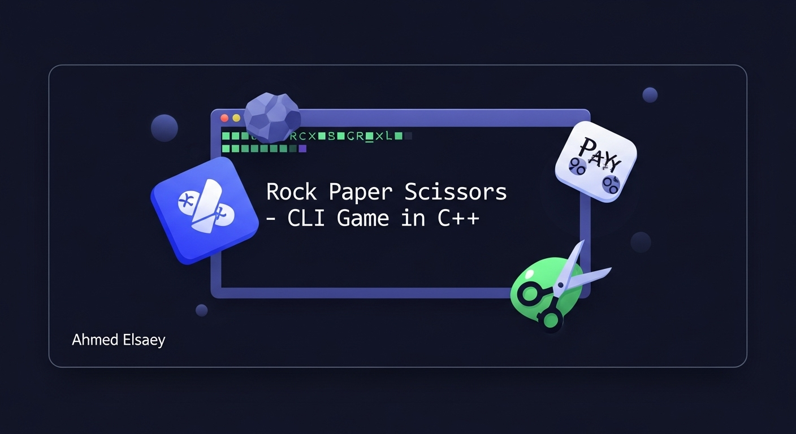

<!-- Banner -->
<p align="center">
  <a href="https://github.com/ahmedelsaey1/Console-RPS-Game">
    
    
  </a>
</p>

<!-- Badges -->
<p align="center">
  <a href="https://github.com/ahmedelsaey1/Console-RPS-Game/stargazers"></a>
  <a href="https://github.com/ahmedelsaey1/Console-RPS-Game/network/members"></a>
  <a href="https://github.com/ahmedelsaey1/Console-RPS-Game/blob/main/LICENSE"></a>
  <a href="https://github.com/ahmedelsaey1/Console-RPS-Game/issues"></a>
</p>

<h1 align="center">Console Rock-Paper-Scissors</h1>

<p align="center">
  A fun, interactive, and classic Rock-Paper-Scissors game built with C++, running directly in your console.
    

  <a href="#-key-features"><strong>Explore the features »</strong></a>
  ·
  <a href="https://github.com/ahmedelsaey1/Console-RPS-Game/issues/new/choose">Report a Bug</a>
  ·
  <a href="https://github.com/ahmedelsaey1/Console-RPS-Game/issues/new/choose">Suggest a Feature</a>
</p>

---

## 📖 Table of Contents

- [About The Project](#-about-the-project )
- [Key Features](#-key-features)
- [Code Architecture](#-code-architecture)
- [Getting Started](#-getting-started)
  - [Prerequisites](#prerequisites)
  - [Build and Run](#build-and-run)
- [Contributing](#-contributing)
- [License](#-license)
- [Contact](#-contact)

---

## 🏛️ About The Project

The **Console Rock-Paper-Scissors** game is a C++ console application that brings the classic hand game to your computer. It serves as an excellent practical example of procedural programming, demonstrating the use of enums for state management, functions for modularity, and loops for game flow control.

This project was developed as a fun coding exercise and as a clear template for building simple, interactive console-based games.

---

## ✨ Key Features

-   **Interactive Gameplay:** Play directly against the computer from your command line.
-   **Custom Rounds:** You decide how many rounds the game will last.
-   **Randomized AI:** The computer's choices are generated randomly for a fair and unpredictable match.
-   **Live Score Tracking:** The game keeps a running tally of wins for the player, the computer, and draws.
-   **Clear Winner Declaration:** An overall winner is announced based on the final score.
-   **Replayability:** A built-in "Play Again" feature allows for endless fun.

---

## 🏗️ Code Architecture

The application follows a clean procedural paradigm, with logic separated into distinct functions for maximum readability and maintainability.

1.  **Game State (`enum`):** The core logic is driven by `enum` types (`enGet`, `enWinner`) which define the possible game choices and outcomes, making the code self-documenting and robust.
2.  **Input/Output (I/O):** A set of functions (`Header`, `GetRound`, `GetPlayer1`) is responsible for all user interaction, from displaying the welcome message to capturing the player's choice.
3.  **Game Logic:** The core engine of the game resides in functions like `CheckWinner` and `print`, which determine the outcome of each round and manage the game's flow.
4.  **Main Loop (`startgame`):** The main game loop controls the entire session, including starting rounds, tracking scores, and handling the "Play Again" functionality.

---

## 🚀 Getting Started

To get a local copy up and running, follow these simple steps.

### Prerequisites

-   A C++ compiler (like g++ or the one included in Visual Studio).
-   This version uses Windows-specific commands (`system("cls")`, `system("color")`) and is best experienced on a **Windows machine**.

### Build and Run

1.  **Clone the repository:**
    ```sh
    git clone https://github.com/ahmedelsaey1/Console-RPS-Game.git
    ```

2.  **Navigate to the project directory:**
    ```sh
    cd Console-RPS-Game
    ```

3.  **Compile the project:**
    ```sh
    g++ main.cpp -o rps_game
    ```

4.  **Run the application:**
    ```sh
    ./rps_game.exe
    ```

---

## 🤝 Contributing

Contributions are what make the open-source community such an amazing place to learn, inspire, and create. Any contributions you make are **greatly appreciated**.

If you have a suggestion that would make this better, please fork the repo and create a pull request. You can also simply open an issue with the tag "enhancement".

1.  **Fork the Project**
2.  **Create your Feature Branch** (`git checkout -b feature/AmazingFeature` )
3.  **Commit your Changes** (`git commit -m 'feat: Add some AmazingFeature'`)
4.  **Push to the Branch** (`git push origin feature/AmazingFeature`)
5.  **Open a Pull Request**

---

## 📜 License

Distributed under the MIT License. See `LICENSE` file for more information.

---

## 🙏 Acknowledgements

Special thanks to the open-source community and everyone who contributed to making this project better. If you want to be featured here, submit a pull request!

---

## 📬 Contact

Ahmed Elsaey - [linkedin](https://www.linkedin.com/in/ahmed-elsaey1) - a7md.elsaey@gmail.com

- [Project Link](https://github.com/ahmedelsaey1/CLI-Banking-System )